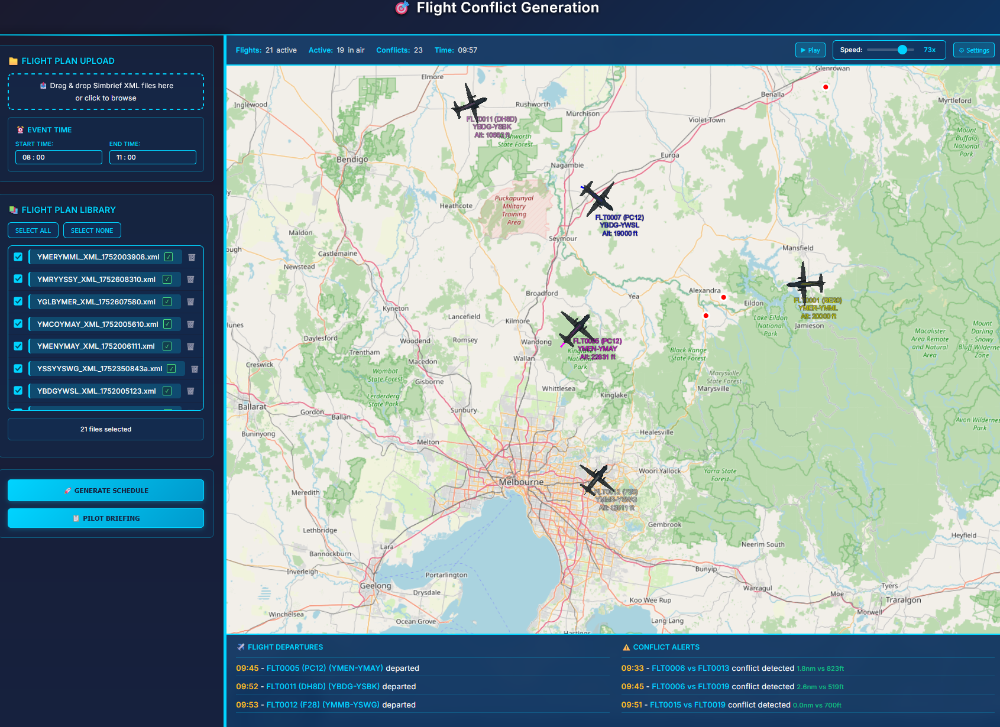
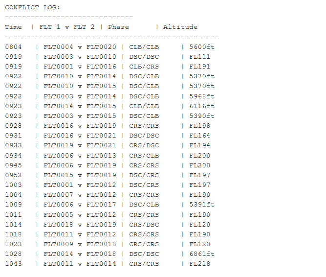
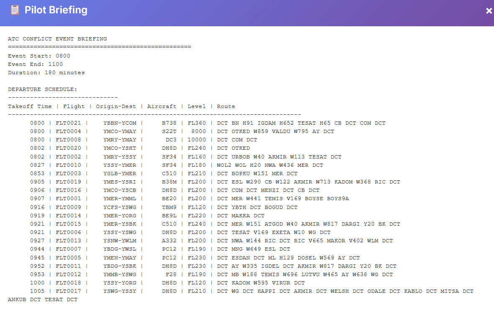
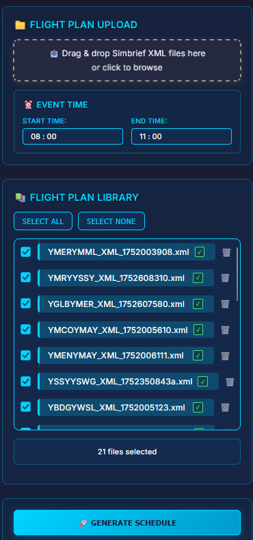
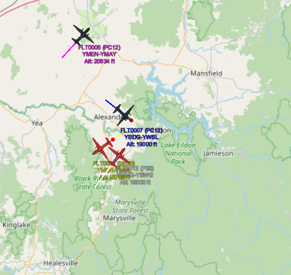
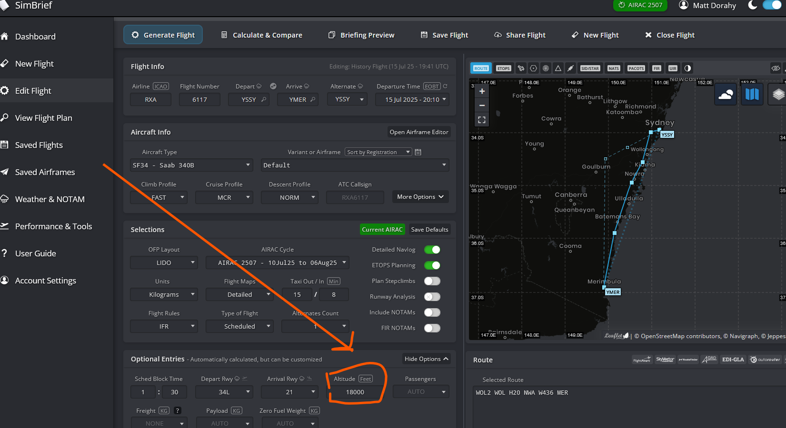

# ATC Conflict Generation System

An application for VATSIM events teams thath generates an event schedule to maximises ATC conflicts. The objecitve of the app is to generate as many conflict as possible. The app takes in SimBrief XML flight plans in xml format and calculates takeoff times for each flight to create challenging air traffic control (ATC) event scenarios. The system is designed for an events team to create situations where controllers are challenged and pilots can enjoy fun, dynamic events. 

For event designers it provides:
- a simple interface for adding simbrief flight plans (pilots dont need simbrief but need to be able to accurately fly a route)
- an animation of the conflicts allowing them to visualise what will happen during the event and add/remove routes accordingly
- a pilot schedule including origin, route, altitude, acft type, takeoff time
- a conflict schedule that can be used to ensure a good even distributoin of conflicts over time and controller


## System Screenshots

### Web Interface


*The modern web interface allows users to upload SimBrief XML files, configure event times, and manage flight plans with drag-and-drop functionality.*

### Conflict Analysis Results


*Detailed conflict log showing detected ATC conflicts with timing, flight pairs, phases, and altitudes.*

### Pilot Briefing Report


*Comprehensive pilot briefing with departure schedule, aircraft details, routes, and flight levels.*

### Simple upload screen



### Event animation with conflicts highlighted


*Live conflict detection interface with real-time flight tracking, departure alerts, and conflict warnings.*


## Demonstration

[](https://youtu.be/8QOuduHmhN8)

### The Data Flow:
```
XML files → Analyse and identify potential conflicts → generate start times per flight that optimises for conflicts create pilot schedule - animate

## Flight ID System

The system now uses unique flight IDs (FLT0001, FLT0002, etc.) instead of origin-destination pairs for better conflict tracking and separation enforcement:

- **Unique Identification**: Each flight gets a sequential flight ID during XML processing
- **Route Preservation**: Origin-destination information is maintained alongside flight IDs
- **Separation Rules**: Both flight IDs and routes are used do generate separation breakdown
- **Conflict Tracking**: Enables tracking of "first conflicts" between unique aircraft pairs


## Installation 

Installation take 5 minutes in a docker environment and can be run on a Raspberry Pi through to AWS

```bash
# Download just the docker-compose.yml
curl -O https://raw.githubusercontent.com/t288matt/vatsim-chaos/main/docker-compose.yml

# Create required directories
mkdir -p temp xml_files logs

# Edit volume paths in docker-compose.yml
nano docker-compose.yml

```

**Find this section:**
```yaml
volumes:
  - /home/matt/data/vatsim-chaos/temp:/app/temp:rw  # Processing results
  - /home/matt/data/vatsim-chaos/xml_files:/app/xml_files:rw  # XML storage
  - /home/matt/data/vatsim-chaos/logs:/app/logs:rw  # Application logs
```

**Change it to the location where youo want these on your setup. Possibly as below:**
```yaml
volumes:
  - ./temp:/app/temp:rw  # Processing results
  - ./xml_files:/app/xml_files:rw  # XML storage
  - ./logs:/app/logs:rw  # Application logs
```

**Start the application:**

# Start using the pre-built image (no build needed!)
docker-compose up -d

# Access the application
# Main Web Interface: http://YOUR_IP:5000

```


### Troubleshooting

#### If ports are already in use:
```bash
# Check what's using the ports
sudo netstat -tulpn | grep :5000
sudo netstat -tulpn | grep :8000

# Stop conflicting services or change ports in docker-compose.yml
```

#### If you need to change ports:
Edit `docker-compose.yml` and change:
```yaml
ports:
  - "YOUR_PORT:5000"  # Change YOUR_PORT to available port
  - "YOUR_ANIMATION_PORT:8000"
```

### Important Notes

- **Animation files are generated inside the container** and are not persisted to the host
- **Uploaded XML files are stored in the `xml_files` directory** on the host
- **Processing results are stored in the `temp` directory** on the host
- **Logs are stored in the `logs` directory** on the host
- **Animation, conflicts an pilot briefing files are recreated each time** you process new flight plans. There is no persistence

The application should be fully functional once the containers are running!


## System Architecture

## Scheduling Algorithm

## Conflict Detection Features

### Detection Methods
- **At Waypoints**: Detects conflicts when aircraft are at the same named waypoint
- **Between Waypoints**: Detects conflicts when routes cross at interpolated points along route segments
- **3D Analysis**: Considers lateral distance, vertical separation, and timing
- **Phase Detection**: Automatically determines climb, cruise, or descent phases based on TOC/TOD

### Conflict Criteria (configurable)
- **Lateral Separation**: < 3 nautical miles
- **Vertical Separation**: < 900 feet
- **Altitude Threshold**: Aircraft must be above 5000 ft
- **Route Interpolation**: Configurable spacing (default 1nm) between generated waypoints

### First Conflict Concept
The system focuses on **"First Conflicts"** - the initial point where two aircraft first meet conflict criteria during their flights. This is critical for event planning because:

- **ATC Intervention Point**: Represents the moment when controllers first need to intervene between aircraft pairs
- **Event Planning**: Helps organisers understand when conflicts will first occur
- **Realistic Scenarios**: Focuses on the most critical conflict moment rather than tracking every subsequent conflict

### Output Formats
- **Detailed First Conflict List**: Shows only the first conflict between each aircraft pair with location, altitudes, times, and phases
- **JSON Export**: Structured data for further analysis (stored in temp directory)
- **KML Visualisation**: Google Earth compatible files

## SimBrief XML Generation Guidelines

### Important: Altitude Handling in SimBrief



When generating XML files in SimBrief, **always explicitly set altitudes** rather than letting SimBrief auto-calculate them. If you let SimBrief auto-calculate altitudes, it may insert unexpected step climbs and descents that pilots wouldn't typically fly.


**Example of SimBrief Auto-Calculated Issues:**
- FL350 → FL360 → FL350 on north-south routes
- Unnecessary step climbs during cruise
- Unrealistic altitude changes that don't match pilot behavior

**Best Practice:**
1. **Set explicit altitudes** for each waypoint in SimBrief
2. **Use realistic climb/descent profiles** (e.g., climb to FL360, cruise, then descend)
3. **Avoid letting SimBrief insert intermediate altitude changes** during cruise
4. **Review the flight plan** to ensure altitude changes match expected pilot behavior

### Critical: Conflict Analysis Based on SimBrief Data

**All conflict detection in this system is based explicitly on the climb profiles and altitudes from SimBrief XML files.** The system reads the exact altitude values and timing from your SimBrief flight plans to determine when and where aircraft will conflict.

**Before submitting XML files to the app:**
1. **Sense-check your SimBrief flight plans** - ensure altitudes and climb profiles are realistic
2. **Verify altitude assignments** - make sure each waypoint has appropriate altitudes for the aircraft type
3. **Review climb/descent profiles** - ensure they match expected pilot behavior for the route
4. **Test with a few flights first** - validate that the conflict analysis produces realistic results

**Why this matters:**
- **Garbage in, garbage out** - unrealistic SimBrief altitudes will produce unrealistic conflicts
- **Event planning depends on accuracy** - controllers need realistic conflict scenarios
- **Pilot behavior modeling** - conflicts should reflect how pilots actually fly these routes

This ensures the generated XML files contain realistic altitude profiles that match how pilots actually fly, leading to more accurate conflict analysis and event scenarios.

### System Limitation: Same Origin-Destination Routes

The system cannot process multiple flights with identical origin-destination pairs. Only the first flight per route will be processed.

**To avoid this limitation:**
- Remove duplicate files with the same origin and destination.

## Web Interface

### Modern ATC-Style Interface
The system now features a modern web interface inspired by VATSIM Radar with:

- **Dark Aviation Theme** - Professional dark colour scheme with aviation blue accents
- **Glass Morphism Effects** - Modern translucent panels with backdrop blur
- **Responsive Design** - Optimised for different screen sizes
- **File Management** - Drag-and-drop upload with validation and file library
- **Event Time Controls** - Frontend time parameter controls (08:00-11:00 default)
- **Real-time Processing** - Live progress tracking with step-by-step status
- **3D Visualization** - Cesium-based 3D map integration
- **Pilot Briefing Modal** - Formatted briefing display with print/download options

### Key Features
- **File Upload**: Drag-and-drop XML file upload with validation
- **File Library**: Manage uploaded files with selection controls and deletion
- **Event Time Window**: Set custom start/end times for conflict generation
- **Generate Schedule**: Process selected files to create conflict scenarios
- **3D Map View**: Interactive Cesium-based visualization of flight paths
- **Pilot Briefing**: Access formatted conflict briefing with export options

### Interface Components
- **Flight Plan Upload**: Upload and validate SimBrief XML files
- **Event Time**: Configure the time window for conflict generation (default: 08:00-11:00)
- **File Library**: Select and manage uploaded files with validation status
- **Generate Schedule**: Process selected files to create conflict scenarios
- **Processing Status**: Real-time progress tracking with step indicators
- **3D Map**: Interactive visualization of flight paths and conflicts
- **Pilot Briefing**: Access and export formatted conflict information

